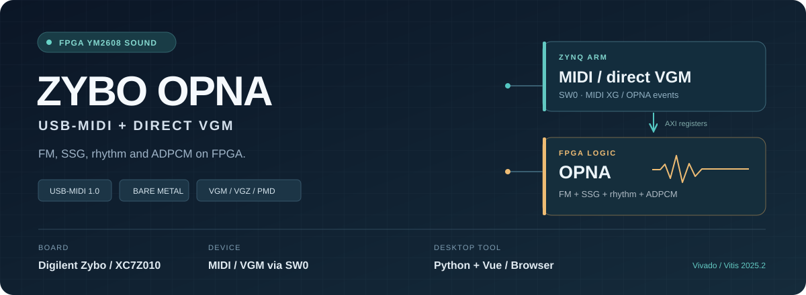
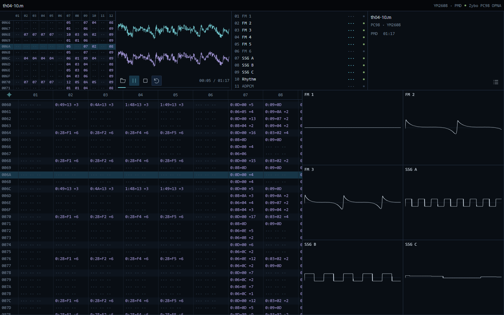
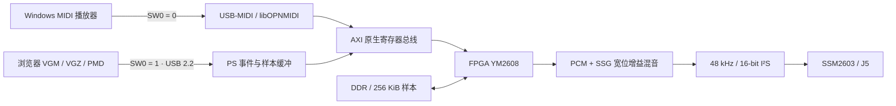
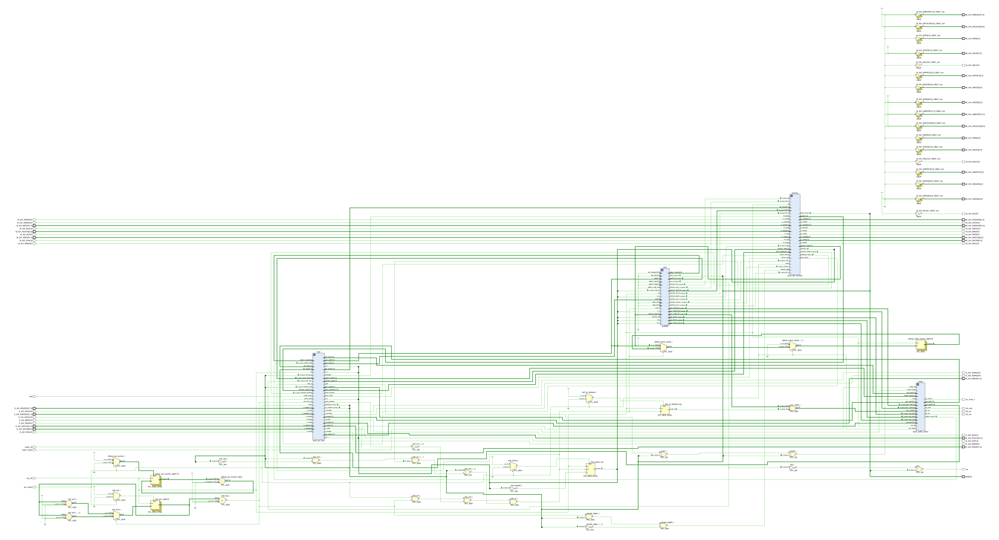
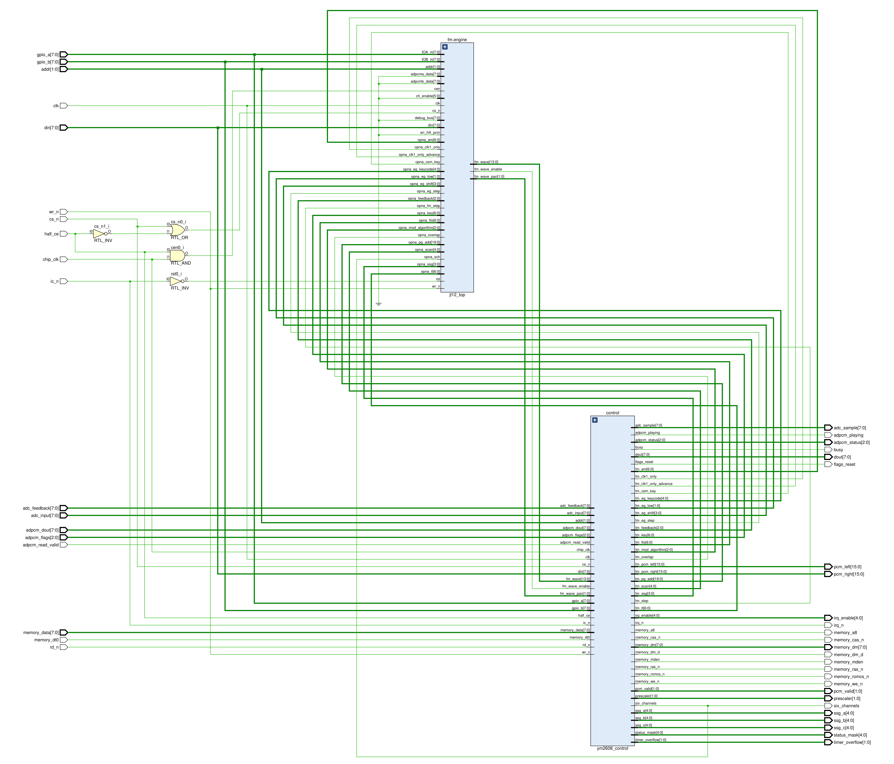

<div align="center">



# Zybo OPNA

**用一个拨码开关，在 USB-MIDI 音源与 PC-98 原曲播放之间切换。**

FPGA YM2608 · FM / SSG / 节奏 / ADPCM · VGM / VGZ / PMD · 浏览器波形播放器

<p>
  
  
  
  
</p>

[快速上手](#快速上手) · [浏览器播放器](#浏览器播放器) · [硬件架构](#硬件架构) · [验证结果](#验证结果) · [源码构建](#源码构建)

</div>

将原版 Zybo 变成独立的 YM2608 / OPNA 音源。SW0 关闭时，Windows 播放器通过标准 USB-MIDI 发送演奏消息；SW0 开启时，项目播放器上传 VGM/VGZ 或 PMD 转换得到的寄存器事件和 ADPCM 样本，由板端按原时间演奏。声音由 FPGA 合成，经 I²S 送到 SSM2603，从 **J5 耳机口**输出。

电脑负责文件解析和界面显示，ARM 负责传输、计时及寄存器调度，FPGA 负责音源运算。浏览器中的波形来自固定的软件参考核心，不是板端模拟录音。

| 入口 / 下载 | 用途 |
| --- | --- |
| [StartPlayer.cmd](StartPlayer.cmd) | 在完整仓库目录中双击，启动本地服务并打开默认浏览器。首次使用安装 Python 依赖，不生成打包 EXE。 |
| [BOOT.bin](firmware/usb_dual/BOOT.bin) | 匹配 FSBL、OPNA FPGA 配置及双模式 PS 固件。 |
| [zybo_opna.bit](firmware/usb_dual/zybo_opna.bit) · [opna_usb_dual.elf](firmware/usb_dual/opna_usb_dual.elf) | 本轮实测的 JTAG 配套镜像，FPGA 接口 `0x26080008`、USB 协议 `2.2`。 |
| [zybo_opna.xsa](firmware/usb_dual/zybo_opna.xsa) · [ps7_init.tcl](firmware/usb_dual/ps7_init.tcl) | 对应硬件平台与 PS 初始化脚本。 |

## 项目亮点

| 能力 | 实际行为 |
| --- | --- |
| **完整 OPNA 数字核心** | 6 路 FM、3 路 SSG、6 路节奏音、ADPCM-B、256 KiB 样本空间与定时器。 |
| **Windows 原生 MIDI** | 标准 USB-MIDI 1.0，使用 Windows 系统类驱动；libOPNMIDI 与 MIT XG 音色库控制六个 FM 声部。 |
| **原始寄存器播放** | VGM/VGZ 直接解析，PMD 使用固定 98fmplayer 驱动转换；8 MiB 事件缓冲、ADPCM 样本上传、暂停/继续/停止与切曲。 |
| **文件音量兼容** | 解析有效 VGM 头、扩展设备音量和全局音量，分别处理 PCM 与配对 SSG；所有歌曲共用 1/8 输出余量。 |
| **宽位混音** | PCM、SSG 和总增益使用 Q16.16，最终舍入/饱和并统计左右削波；不做曲间响度归一化或动态压缩。 |
| **浏览器波形** | 总输出及六个可选声部窗口，可选 FM 1–6、SSG A–C、节奏与 ADPCM；暂停冻结、继续推进、停止清空。 |
| **可核验结果** | 13 首原曲完整播放、样本回读、原生/I²S 探针、整数混音仿真及布局布线时序记录。 |

## 快速上手

### 1. 连接开发板

适用硬件：**原版 Digilent Zybo / XC7Z010 / SSM2603**。

| 接口 / 开关 | 配置 |
| --- | --- |
| **J9 USB OTG** | 接 Windows，JP1 断开，使用 USB 外设模式。 |
| **J11 PROG/UART** | JTAG 下载与串口调试。 |
| **SW0 = 0** | USB-MIDI：`Zybo OPNA MIDI`，`CAFE:4014`。 |
| **SW0 = 1** | 原曲播放：`Zybo PC98 OPNA`，`CAFE:4012`，序列号 `ZOPNAUSB0001`，WinUSB。 |
| **J5 Headphone Out** | 接耳机或有源音箱。 |

运行时切换 SW0 会停止当前播放并重新枚举 USB。OPL3 与 OPNA 的原曲模式共用 VID/PID，播放器通过序列号区分，不能互换 FPGA/PS 镜像。

### 2. 加载匹配固件

推荐先使用 **JTAG 易失加载**，下载上表中同一目录的配套文件。在 Vivado/Vitis 2025.2 环境中运行：

```powershell
$env:XILINX_VITIS = 'J:/FPGA/2025.2/Vitis'
& "$env:XILINX_VITIS/bin/xsct.bat" scripts/phase7_jtag.tcl `
  firmware/usb_dual/zybo_opna.xsa firmware/usb_dual/zybo_opna.bit `
  firmware/usb_dual/opna_usb_dual.elf firmware/usb_dual/ps7_init.tcl
```

脚本中的 JTAG 线缆序列号需与自己的开发板对应。GitHub 二进制文件页可用 **Download raw file** 下载。

`BOOT.bin` 可用于 FAT32 SD 卡根目录启动；断电后按板卡标注设置启动跳线。**本轮验证为 JTAG 加载，未写 SD/QSPI，也未完成独立冷启动验收。**

### 3. 启动播放器

安装 **Python 3.11 x64**，确保 `python` 命令可用。获取完整仓库：

```powershell
git clone --recurse-submodules https://github.com/ryujou/zybo-opna-fpga.git
cd zybo-opna-fpga
.\StartPlayer.cmd
```

首次启动会建立 `.venv` 并安装固定 Python 依赖，需要联网；以后使用已安装环境和仓库自带的网页资源。运行预编译播放器不需要 Node.js、Vivado 或 Qt。控制台保持运行，**Ctrl+C 停止播放并退出服务**；关闭浏览器标签页不会自动停止板端。

- **原曲**：SW0 置 1，在页面打开自己的 `.vgm`、`.vgz` 或 PMD `.m/.m2/.mz/.mp/.pmd`，点击播放。
- **MIDI**：SW0 置 0，在 [Cynthia](https://github.com/blaiz2023/Cynthia) 等 Windows MIDI 播放器中选择 `Zybo OPNA MIDI`。通用 MIDI 使用音色库和声部分配，不等同于原游戏寄存器流。

## 浏览器播放器



文件列表、元数据、播放进度、暂停/继续、停止、重播和同类型顺序切曲共用一个界面。左侧演奏表对应输入事件；右侧六个窗口可以选择不同声部。波形使用固定 libvgm/MAME YM2608 + AY8910 软件参考；固定显示放大 8 倍只影响画面，不改变板端输出增益。

前端沿用 [Zybo OPL3](https://github.com/ryujou/zybo-opl3-fpga) 的 Vue/FastAPI 界面和 OPL3 播放功能，OPNA 文件走独立协议适配，共用本项目的音量解析器。PC98 原曲不会送入 OPL3 软件核心。

VGM 原曲当前支持单颗 YM2608、7.9872 MHz / 8 MHz、文件起始 ADPCM RAM 数据块及已实现的寄存器/等待指令；不支持的时钟、双芯片或命令会明确报错。每次播放执行一遍文件时间轴，不无限循环。歌曲和样本由使用者提供，仓库不分发东方、Grounseed 或 Furnace 演示曲文件。

## 硬件架构



<details>
<summary><strong>查看板级包装层与 YM2608 核的 RTL 图</strong></summary>

#### 板级 AXI / DDR / 音频包装层



`opna_axi_host` 处理 AXI 寄存器访问与原生总线调度；`ym2608` 产生 PCM 和 SSG 输出；`opna_ddr_memory` 连接样本存储；`opna_audio_output` 完成宽位增益混音、削波统计和 I²S 输出。

#### YM2608 核



`ym2608_control` 实现原生总线、定时器、SSG、节奏、ADPCM 与 PCM 输出控制；`fm.engine` 使用适配后的 `jt12_top` 完成六通道 FM 运算。两图均由 Vivado 2025.2 展开本项目 RTL 源码导出。

源码：[板级包装层](hardware/rtl/board/opna_zybo_system.v) · [YM2608 顶层](hardware/rtl/opna_core/ym2608.sv) · [控制与混音](hardware/rtl/opna_core/ym2608_control.sv)。

</details>

| 目录 | 职责 |
| --- | --- |
| [hardware/rtl/opna_core](hardware/rtl/opna_core/) | YM2608 FM、SSG、节奏、ADPCM、定时器与原生总线。 |
| [hardware/rtl/board](hardware/rtl/board/) | AXI、DDR、时钟、增益/削波寄存器和 I²S。 |
| [software/usb_midi](software/usb_midi/) | SW0 双模式、USB-MIDI、libOPNMIDI 与原曲应用。 |
| [software/ps_baremetal](software/ps_baremetal/) | 原生事件/样本协议、codec、板级计时与寄存器接口。 |
| [pc_player](pc_player/) | Python 后端、Vue 前端、软件参考波形与浏览器入口。 |
| [tools/play_pc98.py](tools/play_pc98.py) · [tools/vgm_mix.py](tools/vgm_mix.py) | CLI 与 GUI 共用的原曲、音量解析。 |
| [verification](verification/) | 数字验证摘要与实板结果；不包含歌曲载荷。 |

## 验证结果

验证日期：**2026-10-08**，原版 Zybo / XC7Z010，Windows 11。

| 项目 | 结果 |
| --- | --- |
| 原曲完整测试集 | 六首 TH01/TH03、《少女绮想曲》、三首 Grounseed、Furnace CT / Counterattack / Blue Nebula；13 首共 **1602.327 秒**。 |
| 最终削波 | 全测试集左右饱和计数 **0 / 0**。 |
| 样本与寄存器 | **589376 字节**样本精确回读，1664 次起始寄存器写入检查通过。 |
| 原生 / I²S 探针 | 39 个窗口，319488 个原生点、159744 个 I²S 时钟。 |
| 混音算术 | 2160 组宽整数参考向量、AXI/PS 协议与模式切换检查通过。 |
| 时序与资源 | WNS **+0.070 ns**、WHS **+0.053 ns**；12483 LUT、12772 FF、38.5 BRAM、14 DSP；DRC / 关键 CDC 为 0。 |
| 浏览器实板 | CT 与 Counterattack 上传/暂停/继续/切曲通过；PMD《少女绮想曲》完整 **77.917 秒**，flags=0、queued=0、左右削波=0。 |
| 波形 | 11 组分路相加检查通过；与固定参考渲染的总输出差异小于最终 PCM16 的 1 LSB。 |
| MIDI 基线 | Windows 枚举、Cynthia 三首 MIDI、数字声像/静音、持续消息与 160104 个累计事件接收/处理检查。 |

证据：[音量/混音验收](verification/volume-mix/acceptance.json)、[逐曲汇总](verification/volume-mix/full-summary.json)、[浏览器实板](verification/browser-player/hardware.json)、[MIDI 验证](verification/usb-midi/)。

**验证边界**：软件模型与 FPGA 在噪声、快速包络和部分 ADPCM 波形上仍有差异。数字链路通过不代表原机模拟音频逐样本还原；本轮没有模拟录音或真实 YM2608 芯片的电气比对，也不按歌曲单独调整标定系数。

## 源码构建

完整硬件构建需要 **Vivado / Vitis 2025.2**；Python 工具使用 **Python 3.11、PowerShell 7**。

```powershell
$env:OPNA_VIVADO_ROOT = 'J:/FPGA/2025.2/Vivado'
$env:XILINX_VITIS = 'J:/FPGA/2025.2/Vitis'
python -X utf8 scripts/prepare_reference_assets.py
& "$env:OPNA_VIVADO_ROOT/bin/vivado.bat" -mode batch -source hardware/vivado/phase7_board.tcl
python scripts/build_phase7_ps.py
python software/usb_midi/build.py --dual-mode --boot
```

原生参考资产按来源在本地准备，保留其原权利；详细说明见 [第三方来源](THIRD_PARTY_NOTICES.md)。FPGA 和 PS 必须使用匹配的 XSA/接口版本。

只修改网页时，使用已安装的 Node.js / npm：

```powershell
cd pc_player/web
npm ci
npm run build
```

重建软件波形 DLL 与 PMD 解码器（需要 CMake，使用 Vivado 自带 MinGW/Ninja；不打包播放器 EXE）：

```powershell
python pc_player/native/build_opna.py
python pc_player/native/build.py
python tools/build_pmd_decoder.py
```

输出到 `pc_player/native/bin`。私有曲目测试需要自行准备输入；公开测试不包含歌曲载荷。

## 许可与来源

项目核心、适配和工具遵循 **GPL-3.0-or-later**，第三方代码保留各自许可。libOPNMIDI 使用固定 MIT XG 音色库；PMD 解码器来自 BSD 许可的 98fmplayer；软件波形使用固定 libvgm/MAME 与 libADLMIDI/Nuked。节奏 ROM、原曲和采样不因本项目许可证获得重新授权。详见 [LICENSE](LICENSE)、[第三方来源与版本](THIRD_PARTY_NOTICES.md)。
